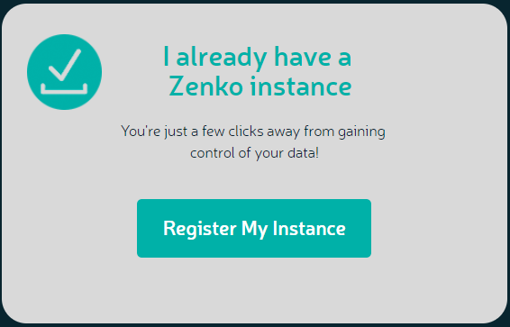
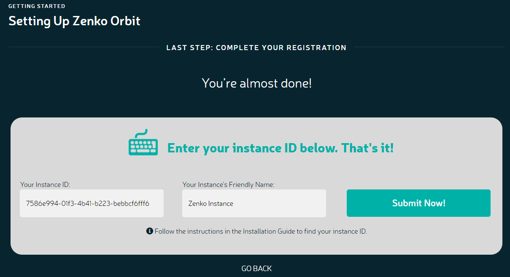

Installation Guide
==================

While it is possible to run Zenko on a single machine, it’s designed for
cluster operation. If you can set up a Kubernetes cluster on your own,
review the :ref:`General Cluster Requirements` and skip to
:ref:`Installing Your Zenko Instance`.

Otherwise, you can set up a cluster quickly using
`MetalK8s <https://github.com/scality/metalk8s/>`__, Scality’s
open-source Kubernetes cluster project, as described in :ref:`Get Ready`.

The following section describes general cluster requirements, which are
tested on MetalK8s. Because MetalK8s is designed to operate without
support from public cloud resources, the following sizing requirements
are assumed good for other cloud Kubernetes deployments, where such
resources are preinstalled and available on demand.

Setting Up a Cluster
--------------------

General Cluster Requirements
~~~~~~~~~~~~~~~~~~~~~~~~~~~~

Setting up a testing cluster requires at least three machines (these can
be VMs) running `CentOS <https://www.centos.org>`__ 7.4 or higher (The
recommended minimum for Zenko production service is five server nodes
with three masters/etcds, but for testing and familiarization, three
masters and three nodes is fine). You must have SSH access to these
machines and they must have SSH access to each other. Each machine
acting as a `Kubernetes <https://kubernetes.io>`__ node must also have
at least one disk available to provision storage volumes.

.. important::
   Once you have set up a cluster, you cannot change the size of the
   machines on it.

Sizing
^^^^^^

The following sizes for Zenko instances have been tested on live systems
using MetalK8s, which adds some overhead. If you are running a different
Kubernetes engine, fewer resources may be required, but such
configurations remain to be tested.

Reserve the following resources for each node.

-  Cores per server

   -  24 vCPU minimum
   -  32 vCPU medium load
   -  58 vCPU heavy load

-  RAM per server

   -  32 GB minimum
   -  64 GB medium load
   -  96 GB heavy load

-  Additional resources

   -  120 GB SSD (boot drive)
   -  80 GB SSD

- Storage

   -  1 TB persistent volume per node

      .. note::

        This requirement is for storage, not for the system device. Storage
        requirements depend on the sizing of different components and
        anticipated use. You may have to attach a separate storage volume to
        each cloud server instance. Storage volumes must match or exceed the
        maximum anticipated demand. Once set, the cluster cannot be resized
        without redefining new volumes.

All servers must run CentOS 7.4 or later, and must be ssh-accessible.

Custom Sizing
^^^^^^^^^^^^^

The default persistent volume sizing requirements are sufficient for a
conventional deployment. Your requirements may vary, based on total data
managed and total number of objects managed.

.. Important::

   Persistent volume storage must match or exceed the maximum anticipated
   demand. Once set, the cluster cannot be resized without redefining new
   volumes.

To size your deployment, review the default values in
Zenko/kubernetes/zenko/values.yaml. This file reserves space for each
component in the build. This is the baseline build, which Helm will
install unless instructed otherwise.

Next, review the values discussed in
Zenko/kubernetes/zenko/storage.yaml. The storage.yaml file contains
sizing instructions and settings that, when specified in a Helm
installation, override the default values expressed in the values.yaml
file. To override default values using storage.yaml, use the following
addendum to the helm install invocation at Zenko deployment.

::

    $ helm install [other options] -f storage.yaml

      .. Note::

        This requirement is for storage, not for the system device. This
        storage requirement depends on the sizing of different components and
        anticipated use. You may have to attach a separate storage volume to
        each cloud server instance. Storage volumes must match or exceed the
        maximum anticipated demand. Once set, the cluster cannot be resized
        without redefining new volumes.

How much persistent volume space is required is calculable based on
total data managed, total objects managed, and other factors. See
storage.yaml for details.

All servers must run CentOS 7.4 or later, and must be SSH-accessible.

Proxies
^^^^^^^

If you are behind a proxy, add the following lines to your local
machine’s /etc/environment file:

::

    http_proxy=http://user;pass@<my-ip>:<my-port>
    https_proxy=http://user;pass@<my-ip>:<my-port>
    no_proxy=localhost,127.0.0.1,10.*

Installing Your Zenko Instance
------------------------------

Set up a cluster of five nodes conforming to the specifications listed
above. If you are using MetalK8s, do this by downloading the latest
stable MetalK8s source code from the MetalK8s releases page:
https://github.com/scality/metalk8s/releases. Follow the Quickstart
guide (in docs/usage/quickstart.rst) to install MetalK8s on your
cluster.

When building your cluster, take sizing into account. If you are
deploying non-default sizing, make sure your volume sizing is
sufficient. For MetalK8s, you *must* size the volumes in the inventory
during setup in metalk8s/inventory/group\_vars/kube-node.yml.

For a default sizing, paste the following into kube-node.yml:

::

    metalk8s_lvm_default_vg: False
    metalk8s_lvm_vgs: ['vg_metalk8s']
    metalk8s_lvm_drives_vg_metalk8s: ['/dev/vdb']
    metalk8s_lvm_lvs_vg_metalk8s:
      lv01:
        size: 125G
      lv02:
        size: 125G
      lv03:
        size: 125G
      lv04:
        size: 62G
      lv05:
        size: 62G

For custom sizing, increase these base numbers.

For non-MetalK8s deployments, follow your vendor or community’s
instructions for configuring persistent volumes at 500 Gi/node.

Get Ready
~~~~~~~~~

#. If you are using MetalK8s, use the MetalK8s virtual shell. If you are
   not in the MetalK8s virtual shell, export the path to your Kubernetes
   admin.conf file.

   From the Kubernetes directory, find admin.conf with

   ::

       $ find ./ -name admin.conf

   This returns the path to admin.conf.

   Export the path to the shell environment.

   ::

       $ export KUBECONFIG=/path/to/admin.conf

Pod Disruption Budgets
^^^^^^^^^^^^^^^^^^^^^^

Zenko relies on several stateful services that require a minimum number
of pods to function with high availability, with resilience under many
outage scenarios. Pod disruption budgets set how many pods of a given
application can safely fail and continue to operate normally before
Kubernetes disables access to the service.

#. If you are using MetalK8s, use the MetalK8s virtual shell. If you are
   not in the MetalK8s virtual shell, export the path to your Kubernetes
   admin.conf file.

   From the Kubernetes directory, find admin.conf with

    ::

      $ find ./ -name admin.conf

   This returns the path to admin.conf.

  Export the path to the shell environment.

    ::

      $ export KUBECONFIG=/path/to/admin.conf

   If you are installing Zenko in a high-availability production environment,
   set a pod disruption budget. If you are installing a basic Zenko deployment
   (for testing or familiarization, for instance) you can skip this step.

The following installed applications allow for configuring disruption
budgets:

- MongoDB
- Redis
- Zenko-Quorum

In a three-node cluster, Zenko configures a ``maxUnavailable`` budget
of 1 by default. However in larger clusters, this could be increased to
match the level of high availablity required. For example, a five-node
cluster can have up to two ``maxUnavailable`` pods per application.

In addition to configuring the node count at install time, you should
also configure the pod disruption budgets. This is an example for
configuring the budgets for a five-node installation.

.. code-block:: yaml

  mongodb-replicaset:
    podDisruptionBudget:
      maxUnavailable: 2
  redis-ha:
    podDisruptionBudget:
      maxUnavailable: 2
  zenko-quorum:
    podDisruptionBudget:
      maxUnavailable: 2

.. note::

    Once installed, pod disruption budgets cannot be changed.
    Consider your environment requirements before installing Zenko.

#. Change to the directory from which you will deploy Zenko:

   ::

       (metal-k8s) $ cd /path/to/installation

   If you are not installing from MetalK8s, follow the instructions in
   Zenko/docs/gke.md to install Helm on your cluster.

#. Initialize Helm:

   ::

       (metal-k8s) $ helm init
       Creating /home/centos/.helm
       Creating /home/centos/.helm/repository
       Creating /home/centos/.helm/repository/cache
       Creating /home/centos/.helm/repository/local
       Creating /home/centos/.helm/plugins
       Creating /home/centos/.helm/starters
       Creating /home/centos/.helm/cache/archive
       Creating /home/centos/.helm/repository/repositories.yaml
       Adding stable repo with URL: https://kubernetes-charts.storage.googleapis.com
       Adding local repo with URL: http://127.0.0.1:8879/charts
       $HELM_HOME has been configured at /home/centos/.helm.
       Warning: Tiller is already installed in the cluster.
       (Use --client-only to suppress this message, or --upgrade to upgrade Tiller to the current version.)
       Happy Helming!
       (metal-k8s) $

   Helm can now install applications on the Kubernetes cluster.

#. Go to https://github.com/Scality/Zenko/releases and download the latest
    stable version of Zenko.

#. Unzip or gunzip the file you just downloaded and change to the top-level
    (Zenko) directory.

Install Zenko
~~~~~~~~~~~~~

Helm installs Zenko using packages of Kubernetes resource definitions known as
charts. These charts, which Helm follows for each Zenko component, can be found
under Zenko/kubernetes/zenko/charts. For each component there is a Chart.yaml
file and a values.yaml file. Helm reads the Chart.yaml file to establish such
basic installation attributes as name and version number, and reads the values
file for instructions on how to deploy and configure the component. Though
manually editing the default settings in values.yaml is possible, it is much
better to write configuration changes and options to
:file:`Zenko/kubernetes/zenko/options.yaml`, which Helm can use to
overwrite the default settings presented in the charts.

Follow these steps to install Zenko with Ingress.

.. note::

    The following example is for a configuration using the NGINX ingress
    controller. If you are using a different ingress controller, substitute
    parameters as appropriate.

#. Create an options.yml file in Zenko/kubernetes/ to store deployment
   parameters. Enter the following parameters:

   ::

       ingress:
         enabled: "true"
         annotations:
           nginx.ingress.kubernetes.io/proxy-body-size: 0
         hosts:
           - zenko.local
       cloudserver:
         endpoint: "zenko.local"

   You can edit these parameters, using each component’s values.yaml
   file as your guide.

   .. important::

     Spacing is critical. Simply copying and pasting the above may result
     in errors.

   Save options.yml.

#. To configure the ingress controller for HTTPS, go to :ref:`Configuring
   HTTPS Ingress for Zenko` for additional terms to add to this chart.

#. If your Zenko instance is behind a proxy, add the following lines to the
   options.yaml file, entering your proxy’s IP addresses and port assignments:

   ::

       cloudserver:
         proxy:
           http: ""
           https: ""
           caCert: false
           no_proxy: ""

   If the HTTP proxy endpoint is set and the HTTPS proxy endpoint is not, the
   HTTP proxy will be used for HTTPS traffic as well.

   .. note::

      To avoid unexpected behavior, only specify one of the “http” or “https”
      proxy options.

#. Perform the following Helm installation from the kubernetes directory:

    ::

        $ helm install --name my-zenko -f options.yml zenko

    If the command is successful, the output from Helm is extensive.

#.  To see K8s’s progress creating pods for Zenko, the command

    ::

        $ kubectl get pods -n default -o wide

    returns a snapshot of pod creation. For a few minutes after Helm
    installs Zenko, some pods will show CrashLoopBackOff issues. This behavior
    is expected, because there is no launch order between pods. After a few
    minutes the cluster will stabilize as all pods enter the Running state.

#.  After installing or upgrading Zenko, some configuration pods that have
    completed their work successfully may linger in an Error or Completed state.
    For example:

    ::

        zenko-zenko-queue-config-abea05e0-7qp7d            0/1     Error       0     4m
        zenko-zenko-queue-config-abea05e0-7wwsv            0/1     Error       0     4m
        zenko-zenko-queue-config-abea05e0-88wgb            0/1     Error       0     4m
        zenko-zenko-queue-config-abea05e0-cg5b5            0/1     Error       0     4m
        zenko-zenko-queue-config-abea05e0-dwzw8            0/1     Error       0     7m
        zenko-zenko-queue-config-abea05e0-q94cc            0/1     Error       0     4m
        zenko-zenko-queue-config-abea05e0-s2f8x            0/1     Completed   0     4m
        zenko-zenko-queue-config-abea05e0-vkv65            0/1     Error       0     4m

    Before deleting these pods, verify that:

   -  All pods are running (as described in the previous step).
   -  One of the zenko-queue-config pods shows a "Completed" state.

   Once these criteria are satisfied, delete these configuration pods
   by deleting the job that spawned them:

    ::

        $ kubectl get jobs
        NAME                                  DESIRED   SUCCESSFUL   AGE
        zenko-zenko-queue-config-a86a68e3     1         1            8m

        $ kubectl delete jobs zenko-zenko-queue-config-a86a68e3
        job.batch "zenko-zenko-queue-config-a86a68e3" deleted

#.  To register your Zenko instance for Orbit access, get your
    CloudServer’s name:

    ::

         $ kubectl get -n default pods | grep cloudserver
         my-zenko-cloudserver-76f657695-c64nc              1/1   Running   0       3m

         [ . . . ]

         my-zenko-cloudserver-76f657695-j25wq              1/1   Running   0       3m
         my-zenko-cloudserver-manager-c76d6f96f-qrb9d      1/1   Running   0       3m

    Then grab your CloudServer’s logs with the command:

    ::

        $ kubectl logs my-zenko-cloudserver-<id> | grep 'Instance ID'

    Using the present sample values, this command:

    ::

        $ kubectl logs my-zenko-cloudserver-76f657695-j25wq | grep 'Instance ID'

    returns:

    ::

        {"name":"S3","time":1532632170292,"req_id":"effb63b7e94aa902711d","level":"info"
        ,"message":"this deployment's Instance ID is 7586e994-01f3-4b41-b223-bebbcf6
        fff6","hostname":"my-zenko-cloudserver-76f657695-j25wq","pid":19}

    Copy the instance ID.

8.  Open https://admin.zenko.io/user in a web browser. You may be
    prompted to authenticate through Google.

9.  Click **Register My Instance**.

    |image0|

10. Paste the instance ID into the Instance ID dialog. Name the instance
    what you will.

    |image1|

Your instance is registered.

