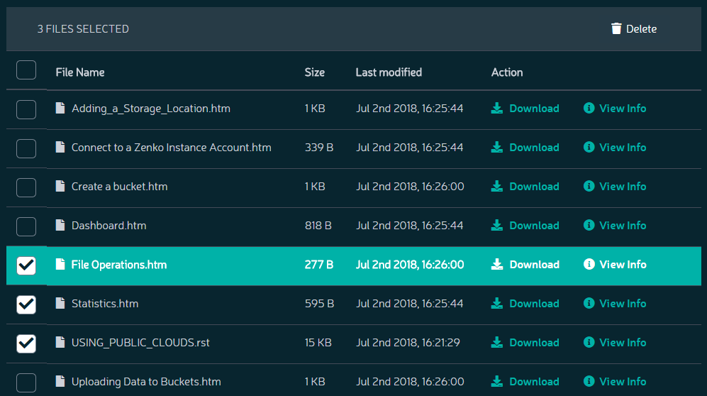

Deleting Files
==============

To delete files from a selected bucket:

#. Click the check box next to each file to be deleted. The number of
   files to be deleted is indicated in the top bar of the file list.

   |image0|

#. Click the **Delete** button.
   |image1|
#. Orbit requests confirmation of the deletion.

   |image2|

#. The file is deleted from the bucket.

   .. note::

    Directories cannot be deleted using this method unless they
    are empty.

`Go back`_

.. _`Go back`: File_Operations.html

