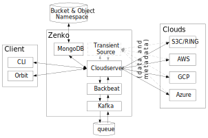

Zenko Services Stack
====================

The following diagram summarizes the Zenko cloud architecture:

|image0|

The Zenko instance depicted above presents an idealized representation
of Zenko’s structure. Several complexities are elided for clarity.

Both transient source and NFS implementations are Transient source
replication is optional and configurable. Transient source storage
requires an on-premises RING deployment (with sproxyd). Implementing
 NFS interpretation requires deploying a Scality RING storage system. If
NFS is not implemented, a RING can be considered a private cloud.

The central square in this diagram represents the suite of
interdependent services required to implement a working Zenko instance.
Deployed, this suite of services is highly available, containerized, and
under the control of Kubernetes. Kubernetes dynamically creates and
destroys services to meet demands.

The following table offers brief descriptions of the Zenko components in
this architecture:

Component

Description

CloudServer

CloudServer is an open-source Node.js implementation of a server
handling the Amazon S3 protocol. It presents the core logic for
translating user inputs and data into stored objects on several cloud
storage systems. With this component, users can create locations
corresponding to different clouds.

Backbeat

Backbeat manages the queues involved in Zenko cloud event tracing (such
as admin\_API, etc.) and job queuing for current actions (such as CRR,
lifecycle management, asynchronous encryption, etc).

Orbit

The Orbit UI offers users controls for CloudServer, workflow management,
user management, and Metadata (MD) instance configuration using such
parameters as location, access key, workflow configuration (CRR, for
example), basic search, etc.

The UI runs in the cloud and is hosted by Scality.

CLI

CloudServer accepts commands from command-line interfaces.

NFS

If configured to do so, CloudServer can accept Network File System
(NFS) commands

MongoDB

An open-source metadata database, MongoDB works with one or multiple
instances in scale-out mode. It also explodes JSON values, allowing
powerful searches and potentially indexing to speed up searches.

Zenko NFS

This service provides NFS support. Implementing this service requires
access to a Scality RING.

 

This service provides SMB support.

Local storage

For locally attached storage, S3 data is used on an external NFS mount
point.

Local RING / sproxyd

For local cloud storage (including transient source), S3 data can be put
to an sproxyd RING.

Semi-Structured Data (and MD) Analytics (Spark)

Advanced big-data analytics on data (with S3) and metadata.

These services and their likely use cases are described in the sections
that follow.

