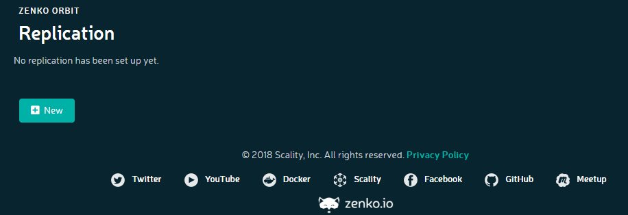
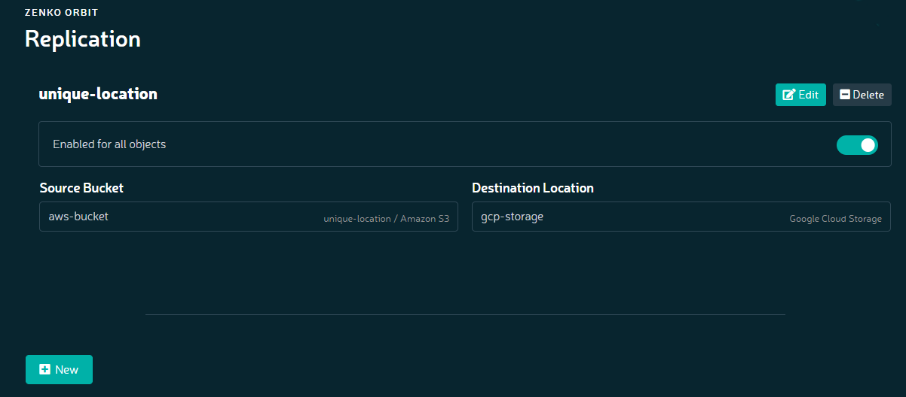

Setting Up Replication
======================

**Prerequisites:** To set up bucket-level CRR using the Orbit UI, you
must have

-  One pre-configured source bucket
-  At least one pre-configured destination bucket

To set up a replication configuration:

#. Click **Replication** in the navigation bar, opening the Replication
   window.

   |image0|

#. Click **New**. The **Set up bucket replication** dialog displays.

   |image1|

   Name the new replication configuration, and enter source and
   destination bucket information. The replication configuration name is
   free-form, and not constrained by Amazon’s naming schema. Click
   **Save**.

#. The named configuration and specified destination(s) display on
   successful implementation.

   |image2|

With one or more replication instances configured, the Replication
window lets you add a new replication configuration, or edit, suspend,
or delete an existing one.

Replication is not retroactive. In other words, if you have files stored
in a bucket and you configure that bucket to be replicated, replication
only occurs to files written to that bucket after you configure and set
the replication.

.. |image1| image:: ../../Resources/Images/Orbit_Screencaps/Orbit_set_up_bucket_replication.png
   :class: FiftyPercent

