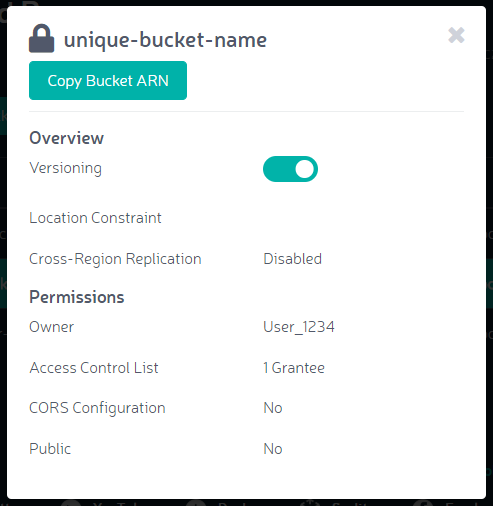

Viewing Bucket Info
===================

**Prerequisite:** To view bucket info, you must already have created at
least one bucket.

Zenko offers the ability to view bucket details, and to turn Versioning
on or off.

To access this feature: 

#. Click the **Browser** item in the navigation pane.
#. The Multicloud Browser **Buckets** list displays:

   |image0|

   Select a bucket from the list of bucket names, then click **View
   Info**.

#. Orbit displays bucket info:

   |image1|

From this panel, you can:

-  Review permissions and the bucket’s cross-region replication status
-  Copy the bucket’s Amazon Resource Name (**Copy Bucket ARN**)
-  Toggle the **Versioning** feature

For more information on versioning, review the Amazon S3 documentation
at: \ https://docs.aws.amazon.com/AmazonS3/latest/dev/Versioning.html .
Zenko implements S3 logic for versioning.

.. |image0| image:: ../../Resources/Images/Orbit_Screencaps/Orbit_multicloud_browser_with_values.png

