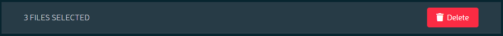
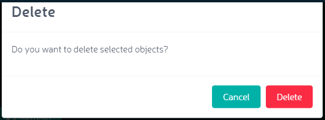

Deleting Files
==============

To delete files from a selected bucket:

#. Click the check box next to each file to be deleted. The number of
   files to be deleted is indicated in the top bar of the file list.

   |image0|

#. Click the **Delete** button.
   |image1|
#. Orbit requests confirmation of the deletion.

   |image2|

#. The file is deleted from the bucket.

   .. important::

      If versioning is enabled (the recommended configuration for
      AWS nodes) deleting from the Orbit UI deletes the most
      recent version of the object only. This results in a condition
      where the bucket appears empty, but continues to contain
      previous versions of the deleted object. This prevents the
      bucket from being deleted, because it is not empty. To completely
      delete an object and its version history requires entering
      the CLI commands described below.

Deleting Versioned Objects
--------------------------

To completely delete a versioned object, you must issue S3 API commands
from the command line.

If you have not already done so, follow the instructions at “Zenko from
the Command Line,” on page 1 to configure one of your nodes to accept
AWS S3 CLI commands.

From your server node,

#. List object versions:

   ::

     $ aws s3api list-object-versions --bucket <bucket> --endpoint-url http://<zenko.endpoint.url> --profile <aws-profile>

   The ``--profile`` option is only required if you have set up more
   than the default profile. Check this from your Zenko node with
   ``cat ~/.aws/credentials``. If only the ``[default]`` profile is
   returned, omit the ``--profile`` option.

   The above command returns the object’s version ID and key.

   ::

     {
       "DeleteMarkers": [
          {
             "Owner": {
                "DisplayName": "user",
                "ID": "e25bcaf4c8ed41aba50891a671e68d76eddb405bd620252075388c340925c77e"
             },
             "IsLatest": true,
             "VersionId": "39383436323730383139313839343939393939395247303031202032302e30",
             "Key": "file.txt",
             "LastModified": "2018-09-18T17:30:08.103Z"
          }
       ]
     }

#. To delete object versions, use the command:

    ::

       $ aws s3api delete-object --bucket <bucket-name> --version-id <versionID> --key <key> --endpoint-url http://<zenko.endpoint.url> --profile <aws-profile>

    which in the present example returns:

    ::

       {
         "VersionId": "39383436323730383139313839343939393939395247303031202032302e30"
       }

#. With all object versions in the bucket thus deleted, you can delete
   the bucket from the command line with:

     ::

       $ aws s3api delete-bucket --bucket <bucket-name> --endpoint-url http://<zenko.endpoint.url>

   or delete the bucket using the Orbit Multicloud Browser.

.. |image0| image:: ../../Resources/Images/Orbit_Screencaps/Orbit_file_delete.png

