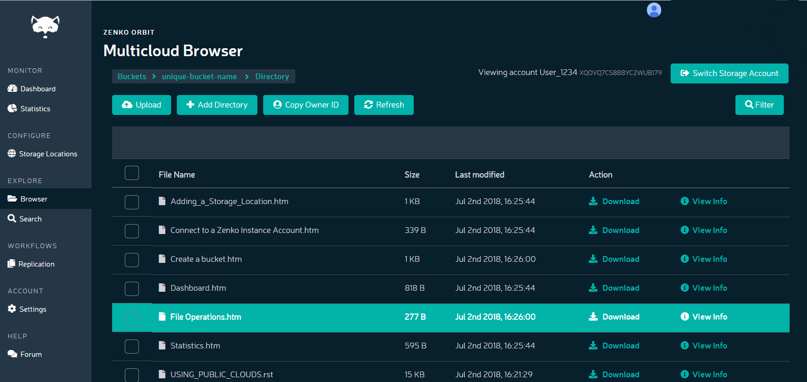

File Operations
===============

**Prerequisites:** You must have at least one account, containing at
least one bucket.

For each file stored in a Zenko bucket, you can view info, manipulate
tags and metadata, download the file to your local machine, or delete
the file from the bucket.

To access these operations:

#. Click **Browser** in the navigation pane.
#. Double-click the bucket you want to access.

   -  If the bucket is empty, Zenko asks you to **Drag and Drop
      Objects**:

      |image0|

      Clicking the Upload Objects button takes you to your local
      machine’s file system to pick files to upgrade. Clicking **skip**
      takes you to the empty bucket.

   -  Otherwise, the Multicloud Browser displays the bucket’s contents:

      |image1|

For each file, you can Download_, `View Info`_, or Delete_.

.. toctree::
   :maxdepth: 1
   :hidden:

     Uploading Files <Uploading_Files_to_Buckets>
     Viewing Files <Viewing_File_Info>
     Downloading Files <Downloading_a_File>
     Deleting Files <Deleting_Files>

.. _Download: Downloading_a_File.html
.. _`View Info`: Viewing_File_Info.html
.. _Delete: Deleting_Files.html

.. |image0| image:: ../../Resources/Images/Orbit_Screencaps/Orbit_upload_objects.png
   :class: FiftyPercent

