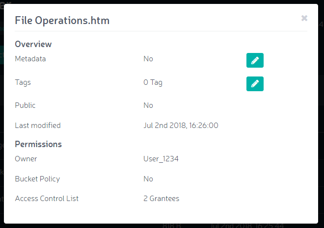

Viewing File Info
=================

To view information about a file

#. Click the **View Info** button. File information displays in a pop-up
   window:

   |image0|

#. Click the pencil icon in the **Metadata** field to add or edit
   metadata options.

   |image1|

   Available options are \ **cache-control**, **content disposition**,
   **content-encoding**, **content-language**, **content-type**,
   **expires**, **website-redirect-location**, and **x-amz-meta**. Most
   of these are HTTP header field definitions, documented at
   https://www.w3.org/Protocols/rfc2616/rfc2616-sec14.html and
   https://www.w3.org/Protocols/rfc2616/rfc2616-sec19.html). The
   x-amz-meta tag acts as a wrapper that indicates that the subsequent
   information is specific to the Amazon S3 protocol. When you pick
   this, an extra field displays to permit entry of this “nested” key
   information.

   |image2|

   This name space must conform to `Amazon’s naming
   rules <https://docs.aws.amazon.com/AmazonS3/latest/dev/BucketRestrictions.html#bucketnamingrules>`__: numbers,
   hyphens, and upper- and lower-case letters only).

#. Click the pencil icon in the **Tags** field to add custom tags.

   |image3|

   These are S3-supported tags (see
   https://docs.aws.amazon.com/AmazonS3/latest/dev/object-tagging.html).
   Because other backends may not support the S3 tagging structure,
   operations that use these tags must be performed using Zenko.

.. |image1| image:: ../../Resources/Images/Orbit_Screencaps/Orbit_add-edit_metadata.png
.. |image2| image:: ../../Resources/Images/Orbit_Screencaps/Orbit_x-amz-meta.png
.. |image3| image:: ../../Resources/Images/Orbit_Screencaps/Orbit_add_tags.png
