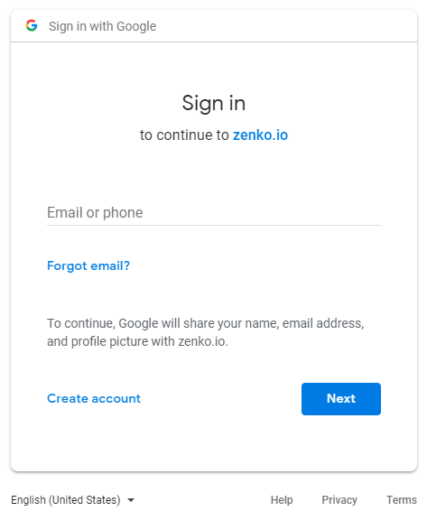
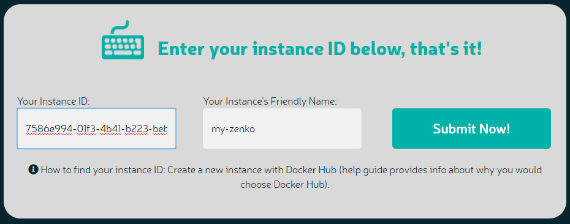

Setting Up a Full Orbit Installation
====================================

Orbit can be run as a user interface to Zenko no matter where or how Zenko is
hosted. You can deploy Zenko in any of the following topologies:

* As a test instance running on a local machine using Minikube
* On a cloud host using MetalK8s (recommended)
* On a cloud host using the host’s native Kubernetes environment (EKS, GKE, AKS).

To run a “full” Zenko installation, you must register your Zenko instance to
Orbit.

#. Go to Zenko.io.
#. Click **Try It!**
#. Authenticate:

   |image0|

#. Review and affirm the Privacy Policy:

   |image1|

#. Click **Register My Instance**.

   |image2|

#. Enter your Instance ID and your instance's name, then click **Submit
   Now!**

   |image3|

   .. tip::

      To find your Instance ID, use the kubectl commands in the
      “Install Zenko” section of the Installation Guide.

.. |image1| image:: ../../Resources/Images/Orbit_Screencaps/Orbit_setup_Privacy.png
   :class: OneHundredPercent

