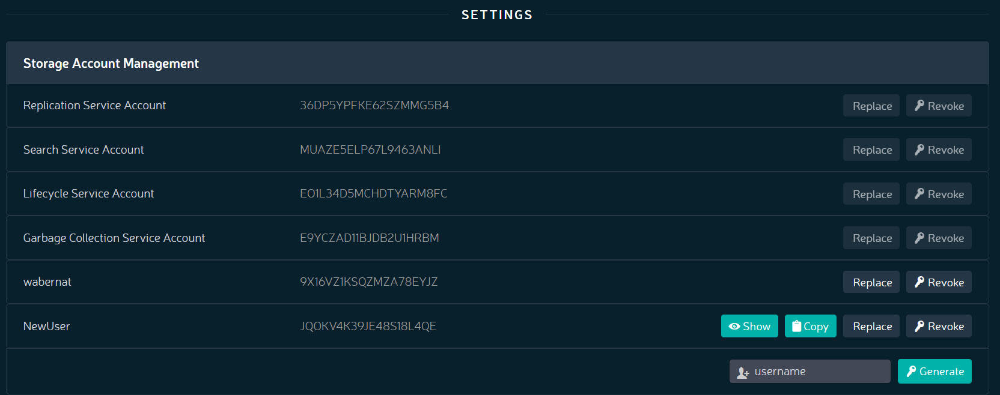

Changing User Credentials
=========================

To change a user’s credentials (public/private key pair) from Orbit.

#. Look for the user’s name in the **SETTINGS** pane.

   |image0|

#. Click **Replace**.
#. Orbit warns you that this could cause problems for the user. Click
   **Regenerate**.

   |image1|

#. Show the new key by clicking the **Show** button or copy it directly
   to your clipboard using the **Copy** button on the user’s line.

   |image2|

   The user’s public key remains unchanged.

.. |image1| image:: ../../Resources/Images/Orbit_Screencaps/Orbit_User_regen_key.png
   :class: FiftyPercent
.. |image2| image:: ../../Resources/Images/Orbit_Screencaps/Orbit_user_secret_key.png
   :class: FiftyPercent
