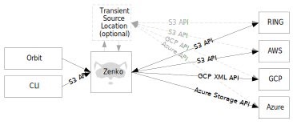
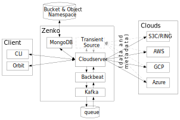

System Architecture
===================

Basics
++++++

Zenko provides a layer that mediates between a user or configured
storage frontend and one or several storage backends.

|image0|

Zenko may use a transient source, which enables it to write once to a
master (local) storage cloud, then replicate the stored data to other
clouds without incurring egress fees from the primary storage cloud.

Zenko uses agile application frameworks such as Kubernetes for
orchestration and Prometheus for monitoring. Zenko is deployed using
MetalK8s either on-premises or in the cloud, or with a cloud Kubernetes
framework (such as GKE, AKS, EKS, or Kops).

Zenko Services Stack
++++++++++++++++++++

The following diagram summarizes the Zenko cloud architecture:

|image1|

The Zenko instance depicted above presents an idealized representation
of Zenko’s structure. Several complexities are elided for clarity.

Transient source replication is optional and configurable. Transient
source storage requires an on-premises RING deployment (with sproxyd).
A RING can be considered a private cloud.

The central square in this diagram represents the suite of
interdependent services required to implement a working Zenko instance.
Deployed, this suite of services is highly available, containerized, and
under the control of Kubernetes. Kubernetes dynamically creates and
destroys services to meet demands.

The following table offers brief descriptions of the Zenko components in
this architecture:

+--------------------+---------------------------------------------------------+
| Component          | Description                                             |
+====================+=========================================================+
| CloudServer        | CloudServer is an open-source Node.js implementation of |
|                    | a server handling the Amazon S3 protocol. It presents   |
|                    | the core logic for translating user inputs and data     |
|                    | into stored objects on several cloud storage systems.   |
|                    | With this component, users can create locations         |
|                    | corresponding to different clouds.                      |
+--------------------+---------------------------------------------------------+
| Backbeat           | Backbeat manages the queues involved in Zenko cloud     |
|                    | event tracing (such as admin\_API, etc.) and job        |
|                    | queuing for current actions (such as CRR, lifecycle     |
|                    | management, synchronous encryption, etc).               |
+--------------------+---------------------------------------------------------+
| Orbit              | The Orbit UI offers users controls for CloudServer,     |
|                    | workflow management, user management, and Metadata (MD) |
|                    | instance configuration using such parameters as         |
|                    | location, access key, workflow configuration (CRR, for  |
|                    | example), basic search, etc.                            |
|                    |                                                         |
|                    | The UI runs in the cloud and is hosted by Scality.      |
+--------------------+---------------------------------------------------------+
| CLI                | CloudServer accepts commands from command-line          |
|                    | interfaces.                                             |
+--------------------+---------------------------------------------------------+
| MongoDB            | An open-source metadata database, MongoDB works with    |
|                    | one or multiple instances in scale-out mode. It also    |
|                    | explodes JSON values, allowing powerful searches and    |
|                    | potentially indexing to speed up searches.              |
+--------------------+---------------------------------------------------------+
| Local RING/sproxyd | For local cloud storage (including transient source),   |
|                    | S3 data can be put to an sproxyd RING.                  |
+--------------------+---------------------------------------------------------+

These services and their likely use cases are described in the sections
that follow.

Zenko Cluster Topology
++++++++++++++++++++++

To operate reliably, Zenko must operate on a cluster of at least three
physical or virtual servers running CentOS 7.4 and either have access to
a virtual Kubernetes instance (EKM, GKM, or AKM) or to an instance of
MetalK8s installed and running on each server.

Zenko is highly available. Load balancing, failover, and service
management are handled dynamically in real time by Kubernetes. This
dramatically improves several aspects of service management, creating a
fast, robust, self-healing, flexible, scalable system. From the user’s
perspective, Zenko is functionally a single instance that obscures the
services and servers behind it.

|image2|

The minimum test configuration is a cluster of three servers, as
depicted above. Five servers is the recommended minimum service
deployment. In actual practice, each server can dynamically deploy up to
ten CloudServer instances, making for a default maximum of 50
CloudServer instances, plus one master. Kubernetes sets the current
upper boundary, defined by the number of pods (including service
pods) that can be run, at 100 pods. The Zenko instance that manages all
these CloudServers spans all deployed and functioning servers, managing
a common name space of data and associated metadata, with Kubernetes
managing individual servers, spinning services up and down in response
to emergent conditions.

`Go Back`_

.. _`Go back`: Architecture.html

