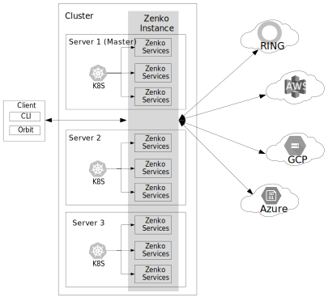

Zenko Cluster Topology
======================

To operate reliably, Zenko must operate on a cluster of at least three
physical or virtual servers running CentOS 7.4 and either have access to
a virtual Kubernetes instance (EKM, GKM, or AKM) or to an instance of
MetalK8s installed and running on each server.

Zenko is highly available. Load balancing, failover, and service
management are handled dynamically in real time by Kubernetes. This
dramatically improves several aspects of service management, creating a
fast, robust, self-healing, flexible, scalable system. From the user’s
perspective, Zenko is functionally a single instance that obscures the
services and servers behind it.

|image0|

The minimum test configuration is a cluster of three servers, as
depicted above. Five servers is the recommended minimum service
deployment. In actual practice, each server can dynamically deploy up to
ten CloudServer instances, making for a default maximum of 50
CloudServer instances, plus one master. Kubernetes sets the current
upper boundary, defined by the number of pods (including service
pods) that can be run, at 100 pods. The Zenko instance that manages all
these CloudServers spans all deployed and functioning servers, managing
a common name space of data and associated metadata, with Kubernetes
managing individual servers, spinning services up and down in response
to emergent conditions.

