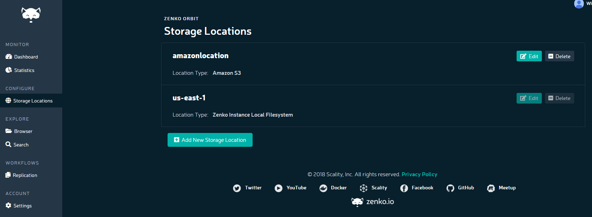

/.. _orbit_add_location:

Adding a Storage Location
=========================

Clicking the **Storage Locations** item in the navigation pane opens the
Storage Locations dialog:

#. To add a storage location, click **Add New Storage Location**.

#. The **Add New Storage Location** dialog displays:

   .. image:: ../../Resources/Images/Orbit_Screencaps/Orbit_Add_New_Storage_Location.png
      :align: center

   a. Enter a location name in the **Location Name** field using
      lowercase letters, numbers, and dashes.

      .. note::

         Capital letters, spaces, and punctuation and diacritical
         marks will result in an error message.

   b. Select a location type from the **Location Type** pull-down menu.
      You can choose:

      * Amazon S3
      * DigitalOcean Spaces
      * Wasabi
      * Google Cloud Storage
      * Microsoft Azure Blob Storage
      * NFS Mount
      * Scality RING with S3 Connector
      * Scality RING with sproxyd Connector
      * Ceph RADOS Gateway
      * A Zenko local filesystem.

#. Each storage location type has its own requirements. No security is
   required for a local file system, but all public clouds require
   authentication information.

Cloud Storage Locations
-----------------------

All the cloud storage services serviced by Zenko require the same basic
information: an access key, a secret key, and a target bucket name. [#f1]_
The Orbit interface also presents the following requirements for each 
cloud storage system.

.. tabularcolumns::X{0.35\textwidth}X{0.15\textwidth}X{0.15\textwidth}X{0.15\textwidth}X{0.15\textwidth}
.. table::

   +---------------+----------+--------+------------+---------+
   | Service       | Endpoint | Bucket | Server-    | Target  |
   |               |          | Match  | Side       | Helper  |
   |               |          |        | Encryption | for MPU |
   +===============+==========+========+============+=========+
   | Amazon S3     | \-       | \-     | Yes        | \-      |
   +---------------+----------+--------+------------+---------+
   | Ceph RADOS    | Yes      | Yes    | \-         | \-      |
   | Gateway       |          |        |            |         |
   +---------------+----------+--------+------------+---------+
   | DigitalOcean  | Yes      | \-     | \-         | \-      |
   | Spaces [#f2]_ |          |        |            |         |
   +---------------+----------+--------+------------+---------+
   | Google Cloud  | \-       | \-     | \-         | Yes     |
   | Storage       |          |        |            |         |
   +---------------+----------+--------+------------+---------+
   | Microsoft     | Yes      | \-     | \-         | \-      |
   | Azure Blob    |          |        |            |         |
   | Storage       |          |        |            |         |
   +---------------+----------+--------+------------+---------+
   | RING/S3C      | Yes      | Yes    | \-         | \-      |
   +---------------+----------+--------+------------+---------+
   | Wasabi        | \-       | \-     | \-         | \-      |
   +---------------+----------+--------+------------+---------+

These configuration options are described below.

Endpoint
~~~~~~~~

Some service providers assign fixed endpoints to customers. Others require 
users to name endpoints. Services for which Zenko requests endpoint names
may have additional naming requirements. For these requirements, review
your cloud storage service provider's documentation. 

.. note::

   The **Add Storage Location** screen for Wasabi presents an 
   endpoint field, but it is not yet editable.

For Ceph RADOS Gateway endpoints, you can nominate a secure port, such
as 443 or 4443. If you do not, the default is port 80. Whichever port
you assign, make sure it is accessible to Zenko (firewall open, etc.). 

Bucket Match
~~~~~~~~~~~~

Zenko provides a "Bucket Match" option for Ceph RADOS Gateway and
Scality S3 Connector. If this option is left unchecked, Zenko prepends
a bucket identifier to every object in the target backend's namespace.
This enables a "bucket of buckets" architecture in which the target
backend sees and manages only one large bucket and Zenko manages the
namespace of the "sub-buckets." Clicking the **Bucket Match** box
deactivates this feature: the prepending of bucket names is defeated,
and the bucket structure in the host cloud is copied identically to
the target cloud.

.. important::

   If the Bucket Match option is set, buckets in the target location
   cannot be used as a CRR destination. Zenko requires the bucket
   identifier in order to manage the namespace for CRR. 

Server-Side Encryption
~~~~~~~~~~~~~~~~~~~~~~

Public cloud services use encryption to ensure your credentials and
transmitted information are protected while in transit. The S3 API
also offers encryption and key management services to secure
information while it is stored on AWS drives. If you have already
created an AWS bucket with server-side encryption enabled (SSE-S3
protocol), clicking **Server Side Encryption** forces Zenko to include
``"x-amz-server-side-encryption": "AES256"`` in API calls to AWS.

Target Helper Bucket for Multi-Part Uploads
~~~~~~~~~~~~~~~~~~~~~~~~~~~~~~~~~~~~~~~~~~~

The Google Cloud Storage solution imposes limitations on uploads that
require specific workarounds. Among these is a 5 GB hard limit on 
uploads per command, which requires objects over this limit to be
broken up, uploaded in parallel chunks, and on a successful upload 
reassembled in the cloud. Zenko manages this complexity, in part, 
by using a "helper" bucket. 

.. note::

   Google Cloud Storage also imposes a 1024-part cap on objects stored
   to its locations (For all other backends, Zenko caps the number of
   parts at 10,000). For data stored directly to GCP as the primary
   cloud, Zenko propagates this limitation forward to any other cloud
   storage services to which Google data is replicated.

Other Services: Zenko Local, RING/sproxyd, and NFS
--------------------------------------------------

Zenko Local Filesystem
~~~~~~~~~~~~~~~~~~~~~~

Zenko Local Filesystem has similar authentication requirements to AWS
S3, but because it is a Zenko-native filesystem, it shares
authentication and related credentialing tasks, which are addressed
elsewhere in the Orbit UI.

For more information, see :ref:`Zenko\ Local`

RING with sproxyd Connector
~~~~~~~~~~~~~~~~~~~~~~~~~~~

The RING maintains stability and redundancy in its object data stores
by way of a bootstap list. To directly access a RING using sproxyd,
you must enter at least one bootstrap server; however, more is better.
This is simply a list of IP addresses for the bootstrap servers in the
RING. The order of entry is not important: none enjoys a preferred
position. Entries must assign a port number. If a port number is not
explicitly assigned, Zenko assigns port 8081 by default. Entries can
use DNS or IP address format.

NFS
~~~

Zenko supports replication from NFSv3 and NFSv4 file systems to all
supported clouds. Because this protocol is not object-based, it does
not employ namespace metadata or a bucketing schema as modern cloud
storage protocols do. Thus, many of the advanced metadata-dependent
features available on cloud services (metadata search, dynamic CRR,
etc.) are unavailable on NFS. Zenko replicates data from NFS servers
to cloud storage services using scheduled cron jobs.

Configuring NFS requires you to specify the transfer protocol (TCP or
UDP), NFS version (v3 or v4), the server location (IP address or URI),
export path (the path to the NFS mount point on the server to be
replicated) and the desired NFS options (rw and async are the default
entries).

Transient Sources
-----------------

Both RING with sproxyd and Zenko Local file systems can be configured
as transient sources. The transient source can be deployed as a
"buffer" for replication to cloud locations. This configuration
enables replication from a local service to multiple "parallel" cloud
locations without incurring egress fees. Once data has been
replicated, it is deleted from the transient source.

Configuring a location as a transient source requires checking the
**Delete objects after successful replication** box under the
**Advanced Options** submenu.

See :ref:`transient-source` for details.

.. [#f1] Microsoft's setup procedure is functionally identical to that of AWS
   S3. However, the Microsoft terms, "Azure Account Name" and "Azure Access Key"
   correspond, respectively, to the AWS terms "Access Key" and "Secret Key." 
   Do not confuse Amazon's "access key" (a public object) with Microsoft's 
   "access key" (a secret object).

.. [#f2] DigitalOcean uses different nomenclature ("Space Name" instead of 
   "bucket name," for example) but its constructs are functionally identical
   to Amazon S3's.

