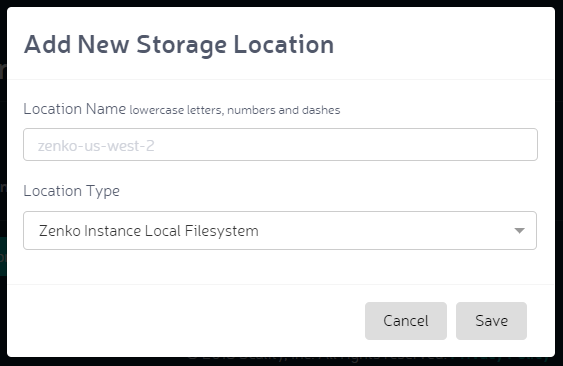

.. _orbit_add_location:

Adding a Storage Location
=========================

Clicking the **Storage Locations** item in the navigation pane opens the
Storage Locations dialog:

|image0|

#. To add a storage location, click **Add New Storage Location**.
#. The **Add New Storage Location** dialog displays:

   |image1|  

   a. Enter a location name in the **Location Name** field using
      lowercase letters, numbers, and dashes.

      .. note::

         Capital letters, spaces, and punctuation or diacritical
         marks will result in an error message.

   b. Select a location type from the **Location Type** pull-down menu.
      You can choose:

      * Amazon S3
      * DigitalOcean Spaces
      * Wasabi
      * Google Cloud Storage
      * Microsoft Azure Blob Storage
      * NFS Mount
      * Scality RING with S3 Connector
      * Scality RING with sproxyd Connector
      * Ceph RADOS Gateway
      * A Zenko local filesystem.

#. Each storage location type has its own requirements. No security is
   required for a local file system, but all public clouds require
   authentication information.

  .. note::

    Google Cloud Platform's unique architecture demands Zenko apply a
    1024-part cap. For all other backends, Zenko caps the number of
    parts at 10,000.

.. |image0| image:: ../../Resources/Images/Orbit_Screencaps/Orbit_Storage_Locations.png

