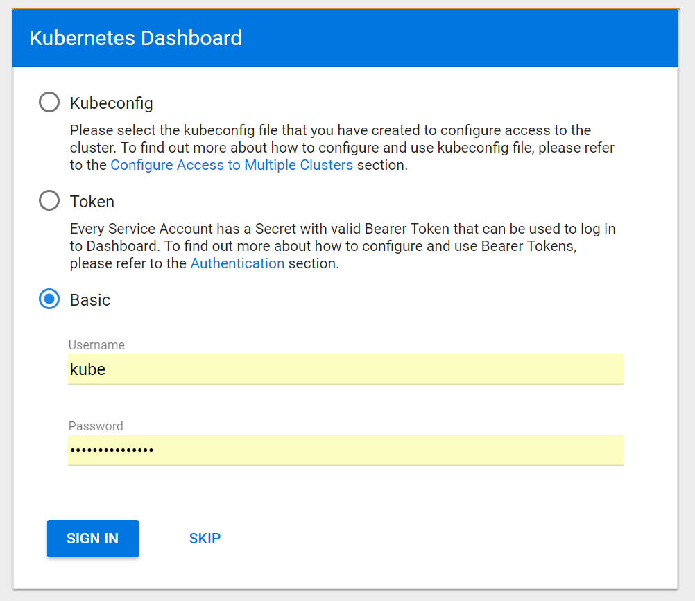

Accessing Cloud Dashboards
==========================

To access cloud management dashboards,

#. With Zenko installed on a Kubernetes cluster, open a command line on
   your local workstation and enter ``kubectl proxy`` from your local
   Kubernetes repo. This opens a kubectl proxy session that enables you
   to access dashboards. Leave this process running.
#. Make sure the path to the cluster’s configuration file is exported to
   the environment. For a MetalK8s installation, open another
   command-line interface and export the path to the configuration file
   with the following command:

   ::

       $ export KUBECONFIG=`pwd`/inventory/<cluster-name>/artifacts/admin.conf

#. Open a browser, and enter the Kubernetes dashboard at:
   http://localhost:8001/api/v1/namespaces/kube-system/services/https:kubernetes-dashboard:/proxy/#!/overview?namespace=default
#. Log into your Kubernetes installation.

   |image0|

   .. tip:: If you used MetalK8s for your Kubernetes installation and
      want to use Basic authentication, look for your user name and
      password in the inventory file. The default location is:

      ::

        /[...]/metalk8s/inventory/<cluster name>/credentials/kube_user.creds

#. The Kubernetes dashboard displays:

   |image1|

For MetalK8s deployments, if the Kubernetes dashboard is visible, you
can also access the other Kubernetes-dependent services Zenko offers as
part of its default stack.

.. _Troubleshooting\ Cloud\ Dashboards:

Troubleshooting Cloud Dashboards
--------------------------------

To operate, Zenko ties together several systems, many of which are not
part of the core Zenko product. Because of this, describing every
possible configuration impossible; however, these are the main points of
failure when accessing cloud dashboards.

The dashboards to control, monitor, and adjust your Kubernetes cluster
and Zenko instance are available when the following conditions are met:

-  The cluster is operating.
-  The appropriate ports on the cluster are open.
-  Your local environment has access to the admin.conf file, which is
   also stored on the cluster.
-  Cluster ingress is configured correctly and identified accurately
   on the local machine.
-  There is an open kubectl proxy session.
-  You have the correct credentials.

Cluster Is Up
~~~~~~~~~~~~~

To be sure the cluster is operating, check out the management interface
and make sure all nodes of your cluster are up and running. Check to see
that all nodes are live, and that each node has an attached and running
storage volume. You may be able to diagnose problems by sending kubectl
commands to the cluster. For a complete listing of active pods and their
current status, enter:

::

    $ kubectl get pods

To find backbeat-api status, enter:

::

    $ kubectl get pods -l app=backbeat-api

The filtered result is:

::

   zenko-backbeat-api-787f756fb7-8hwh4               1/1       Running   6        2d

If you are concerned about a particular node’s health, enter:

::

    $ kubectl get nodes

Ports Are Open
~~~~~~~~~~~~~~

Make sure each node is configured with ports 6443, 80, and 443 open and
accessible to incoming traffic from your local machine.

KUBECONFIG Environment Variable is Correctly Set
~~~~~~~~~~~~~~~~~~~~~~~~~~~~~~~~~~~~~~~~~~~~~~~~

If you are in the ``make shell`` virtual environment from which you
created a MetalK8s deployment, the appropriate environment variables are
already set. If you can’t enter this virtual environment or are using
another Kubernetes, find the admin.conf file, which was generated with
your Kubernetes setup. Your local machine must know where to find this
file.

To see whether this is set properly in your environment, enter

::

    $ env | grep KUBE

If the KUBECONFIG environment variable is set, the response shows a path; for
example:

::

    KUBECONFIG=/home/username/metalk8s/admin.conf

If KUBECONFIG is not set (that is, the ``env`` command shows no result for
KUBECONFIG), you must export the path. Once you find the path to admin.conf,
export it with:

::

    $ export KUBECONFIG=/path/to/admin.conf

The admin.conf in the local client device must match the admin.conf file
in the Kubernetes cluster. For MetalK8s, this is defined in the inventory at
[...]/metalk8s/inventory/<cluster-name>/artifacts/admin.conf and is
copied to /etc/kubernetes/admin.conf on deployment.

Windows users may experience trouble if the admin.conf file is installed
in a user’s personal directory. Windows may inject a space in the user
name, which breaks the path. If you use a Windows machine, make sure
admin.conf resides in a path that contains no spaces.

.. _kubectl_proxy:

Proxy Is On
~~~~~~~~~~~

To access the cloud dashboards, you must open and maintain a kubectl
proxy session. Open a terminal, run the following command, and leave it
running.

::

    $ kubectl proxy
    Starting to serve on 127.0.0.1:8001

Correct Credentials
~~~~~~~~~~~~~~~~~~~

You must have correct credentials to access the Kubernetes dashboard.
For MetalK8s deployments, look for Kubernetes credentials in
[...]/metalk8s/inventory/<cluster-name>/credentials/kube\_user.creds.
Copy and paste this file’s contents as the password when you log in to
the MetalK8s Kubernetes desktop. If you have recently reinstalled a
cluster, make sure your browser is not presenting old credentials. Other
Kubernetes engines may employ different authentication strategies. For
any such problems, request help from the Kubernetes vendor or community
you have chosen.

.. _`Kubernetes Dashboard`: Kubernetes_Dashboard.html

.. |image1| image:: ../Resources/Images/Orbit_Screencaps/kubernetes_dashboard.png
   :class: OneHundredPercent
