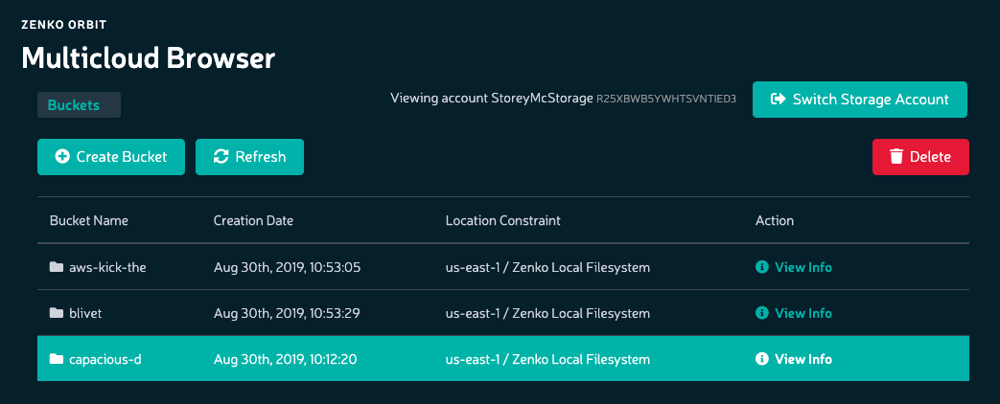

Uploading Files to Buckets
==========================

**Prerequisites:** Before uploading data to a bucket, you must have a
storage account associated with a user name, and you must have created
at least one bucket.

#. Click **Browser** in the sidebar to open the Multicloud Browser:

   .. image:: ../../Graphics/sidebar_browser_button.png

#. Double-click the bucket to which you will upload data. 

   |image0|

   - If the bucket is empty, the **Drag and Drop Objects** dialog displays:

     |image1|

   - Otherwise, Orbit displays the bucket's contents:

     .. image:: ../../Graphics/Orbit_file_operations.png

   - Click **Upload** to raise the **Drag and Drop Objects** dialog.
  
     .. image:: ../../Graphics/upload_button_hover.png

#. In the **Drag and Drop Objects** dialog, you can either upload files by
   dragging and dropping from the local desktop (Windows Explorer, OS X, Linux
   desktop, for example) or by clicking the **Upload Objects** button and
   selecting files for upload using your local operating system's file manager.

   .. note::

      Browsers may limit the ability to upload directories. Uploading a
      directory may require that you recursively zip the directory and upload it
      as a single file, or access XDM through a cloud storage browser such as
      Cyberduck.

   .. note::

      Object key name lengths are limited to 915 single-byte characters (109
      fewer than the 1024 one-byte characters permitted in the AWS
      specification).

.. |image1| image:: ../../Graphics/Orbit_upload_objects.png
