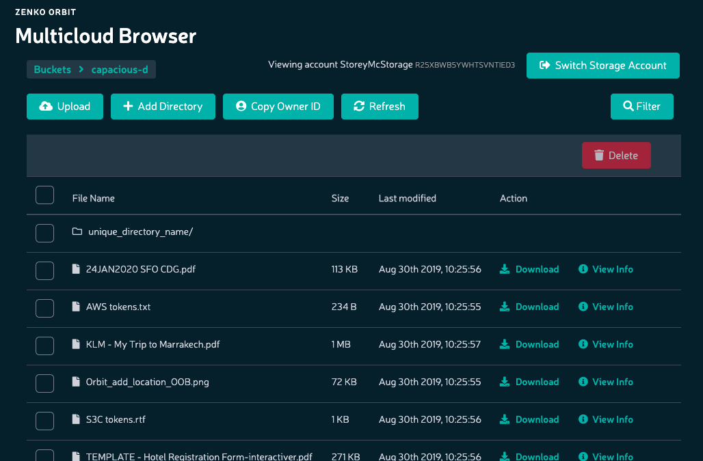

File Operations
===============

**Prerequisites:** You must have at least one account, containing at
least one bucket.

For each file stored in a Zenko bucket, you can view info, manipulate
tags and metadata, download the file to your local machine, or delete
the file from the bucket.

To access these operations:

#. Click **Browser** in the sidebar to open the **Multicloud Browser**.
#. Double-click the bucket you want to access.

   -  If the bucket is empty, Zenko asks you to **Drag and Drop
      Objects**:

      |image0|

      Clicking **Upload Objects** takes you to your local machine’s file
      system to pick files to upgrade. Clicking **skip** takes you to the
      empty bucket.

   -  Otherwise, the Multicloud Browser displays the bucket’s contents:

      |image1|

For each file, you can Download_, `View Info`_, or Delete_.

.. toctree::
   :maxdepth: 1
   :hidden:

     Upload Files <upload_files_to_buckets>
     View Files <view_file_info>
     Download Files <download_a_file>
     Delete Files <delete_files>

.. _Download: download_a_file.html
.. _`View Info`: viewing_file_info.html
.. _Delete: delete_files.html

.. |image0| image:: ../../Resources/Images/Orbit_Screencaps/Orbit_upload_objects.png
   :class: FiftyPercent

