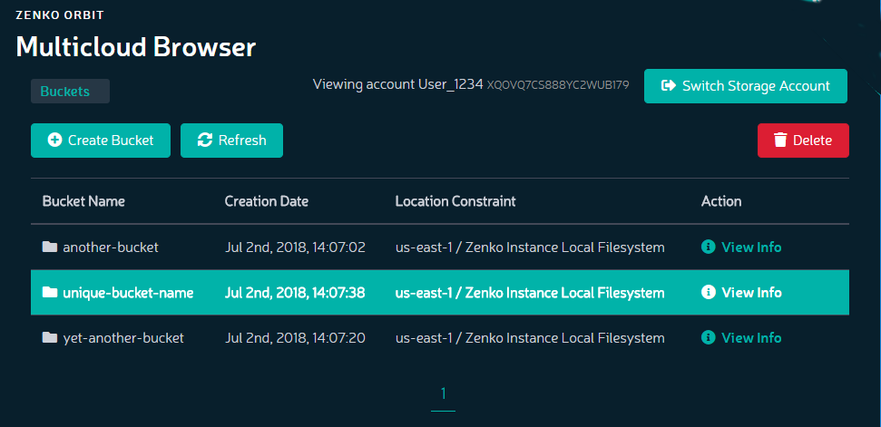
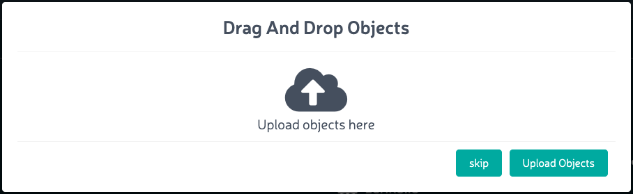

Uploading Files to Buckets
==========================

**Prerequisites:** Before uploading data to a bucket, you must have a
storage account associated with a user name, and you must have created
at least one bucket.

#. Click the Browser item in the navigation pane. The **Multicloud
   Browser** window displays:
   |image0|
#. Double-click the bucket to which you will upload data. The Drag and
   Drop Objects dialog displays:

   |image1|

#. You can upload files either by dragging and dropping from the local
   operating system (Windows Explorer, OS X, Linux desktop) or by
   clicking the **Upload Objects** button.

   .. note::

      Browsers may limit the ability to upload directories.
      Uploading a directory may require that you recursively zip the
      directory and upload it as a single file, or access Zenko through a
      cloud storage browser such as Cyberduck.

   .. note::
      
      Object key name lengths are limited to 915 single-byte
      characters (109 fewer than the 1024 one-byte characters permitted in the
      AWS specification).

