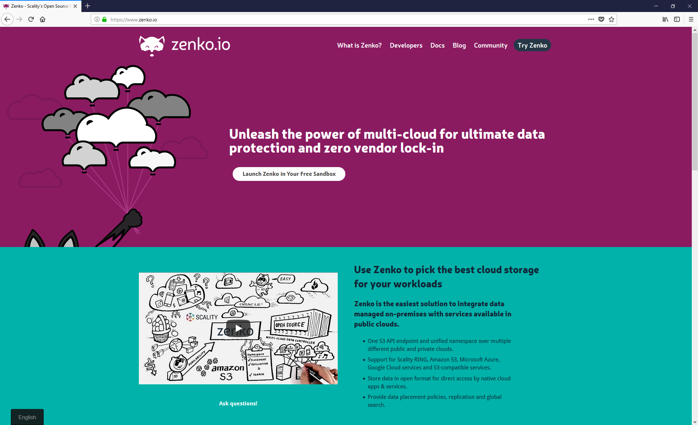
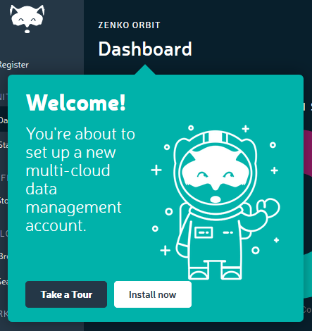
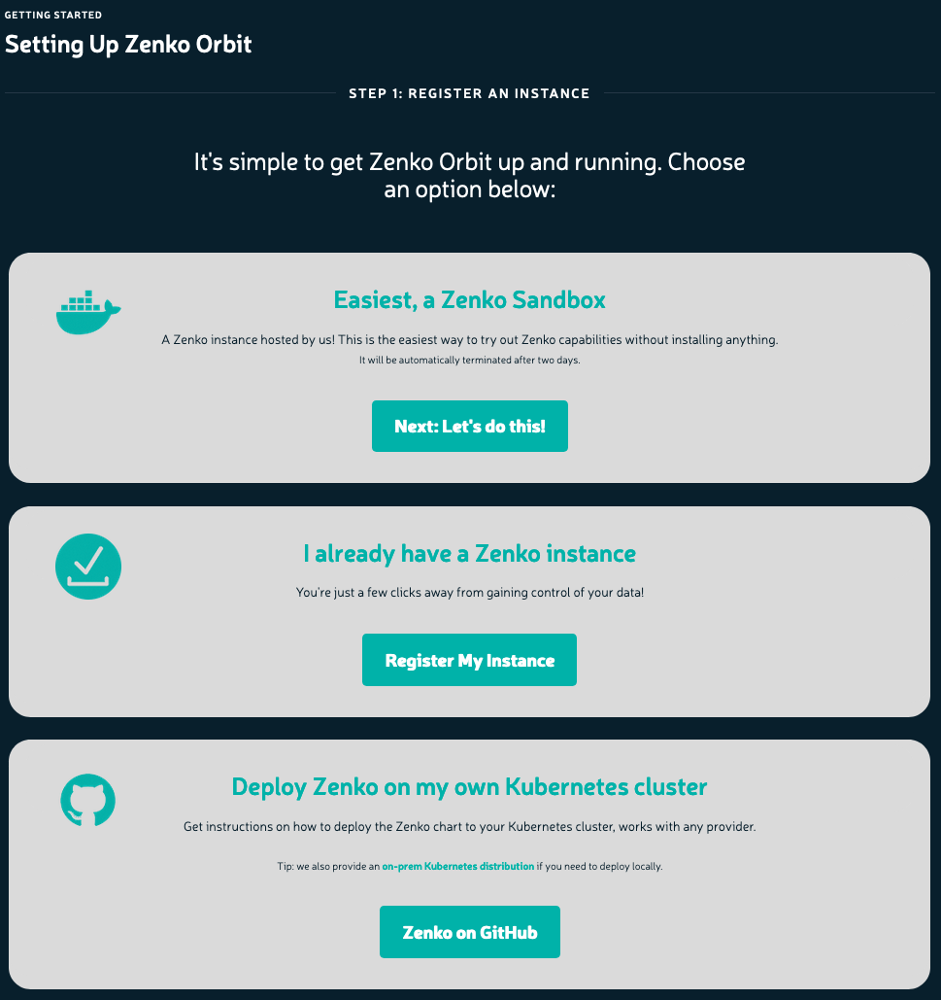
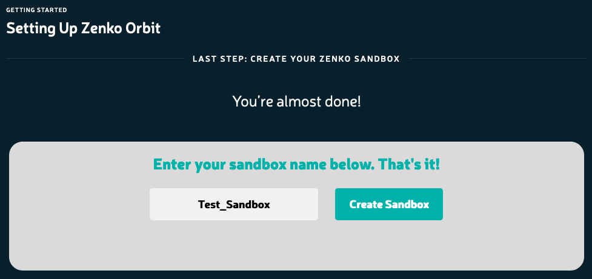

Setting Up a Zenko Orbit Sandbox Instance
=========================================

A good way to learn how to use Orbit is through the sandbox feature
available at https://www.zenko.io/ under “Try Zenko”.

**Prerequisites**

-  A web-connected browser
-  One or more cloud storage targets (AWS, RING, GCP, Azure, etc.)

The Sandbox is a great place to learn how Orbit will help you manage
your data. To set up a Sandbox instance:

#. Open `https://Zenko.io <https://zenko.io/>`__, and click **Try
   Zenko** 

   |image0|

#. The Welcome dialog displays:

   |image1|

   Click **Install now**.

#. The REGISTER AN INSTANCE screen displays:

   |image2|

   Choose the Sandbox option (**Next: Let's do this!**)

#. The **Last Step: Create Your Zenko Sandbox** screen displays:

   |image3|

   Enter a name for your sandbox and click **Create Sandbox**.

#. After less than a minute, the **Settings** window displays:

   |image4|

   You’ve created your sandbox!

   The sandbox runs against a Zenko instance hosted by Scality. This is
   a demonstration instance, limited both in its duration and in the
   amount of data it can handle. Nonetheless, you can use it to watch
   Zenko in action.

.. |image4| image:: ../../Resources/Images/Orbit_Screencaps/Orbit_settings.png
