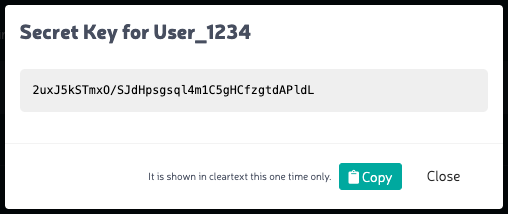

.. _`add new user`:

Adding a New User
=================

#. Click **Settings** in the navigation pane.

#. Enter a new user name in the **Username** field and click
   **Generate**.

   |image0|

#. Orbit shows a success banner indicating the user has been created:

   |image1|

#. Click **Show** to see the secret key associated with this user:

   |image2|

   Copy this key and store it.

  .. warning::

     You will not get a second chance to copy this key! If you lose the key, the
     user name and any information associated with it will be lost as well.

  A **Copy** button is included in the user interface for your convenience.

.. |image0| image:: ../../Resources/Images/Orbit_Screencaps/Orbit_user_create_enter_username.png
   :class: FiftyPercent
.. |image1| image:: ../../Resources/Images/Orbit_Screencaps/Orbit_user_create_success.png

