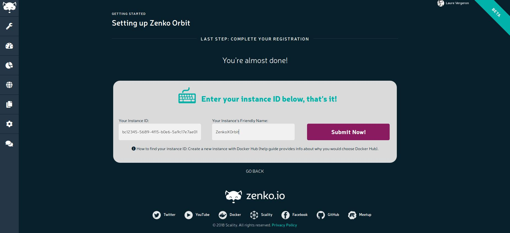

# Registering a Zenko Instance on Orbit Management UI

This section of documentation will help you register your Zenko instance on
Orbit, for either [minikube](../kubernetes/zenko/minikube.md)-based or
[MetalK8s](../kubernetes/zenko/README.md)-based or
[Docker Swarm](./swarm_production_link)-based deployments.

## Minikube and MetalK8s (and other Kubernetes-based deployments)

### Step 1: go to the Kubernetes dashboard

##### For minikube:
```
$ minikube dashboard
```
A new tab should open in your browser, taking you to the Kubernetes dashboard.

##### For MetalK8s:
```
$ kubectl proxy
```
While the tunnel is up and running, access the dashboard at
[http://localhost:8001/api/v1/namespaces/kube-system/services/https:kubernetes-dashboard:/proxy/](http://localhost:8001/api/v1/namespaces/kube-system/services/https:kubernetes-dashboard:/proxy/).

### Step 2: finding the Zenko instance ID

#### Option A: from the CloudServer logs

From the dashboard, click on the cloudserver service, and then on one of
the pods running for that service. On the top right menu, click "Logs", and then
do a search of "instance ID" - you should find a line in the logs giving you a
long string of random characters: this is your instance id, copy it. If you
cannot find such a line in the logs, try option B.

#### Option B: from the Metadata MongoDB cluster

From the dashboard, click on the mongodb-replicaset service, and then on the
pod that is mongodb-replicaset-**0**. For fresh deployments, the pod 0 should be
the MongoDB master, and note MongoDB can only be queried from the master pod.

> TIP: if the following procedure doesn't work for you, and you get an error
> like `"not master and slaveOk=false"`, it means the pod inside which you are
> executing those commands is not the master. In that case, simply use
> [`db.isMaster.primary`](https://docs.mongodb.com/manual/reference/command/isMaster/#isMaster.primary)
> to find the master node, execute the procedure inside that node.

Then hit "Exec", in the top right menu of the dashboard, and use the CLI to
query MongoDB as follows

``` shell
$ mongo
MongoDB shell version v3.4.15
connecting to: mongodb://127.0.0.1:27017
MongoDB server version: 3.4.15
Welcome to the MongoDB shell.
For interactive help, type "help".
For more comprehensive documentation, see
        http://docs.mongodb.org/
Questions? Try the support group
        http://groups.google.com/group/mongodb-user
Server has startup warnings: 
2018-05-25T15:44:08.084+0000 I STORAGE  [initandlisten] 
2018-05-25T15:44:08.084+0000 I STORAGE  [initandlisten] ** WARNING: Using the XFS filesystem is strongly recommended with the WiredTiger storage engine
2018-05-25T15:44:08.084+0000 I STORAGE  [initandlisten] **          See http://dochub.mongodb.org/core/prodnotes-filesystem
2018-05-25T15:44:08.503+0000 I CONTROL  [initandlisten] 
2018-05-25T15:44:08.503+0000 I CONTROL  [initandlisten] ** WARNING: Access control is not enabled for the database.
2018-05-25T15:44:08.504+0000 I CONTROL  [initandlisten] **          Read and write access to data and configuration is unrestricted.
2018-05-25T15:44:08.504+0000 I CONTROL  [initandlisten] ** WARNING: You are running this process as the root user, which is not recommended.
2018-05-25T15:44:08.504+0000 I CONTROL  [initandlisten] 

rs0:PRIMARY> use metadata
switched to db metadata

rs0:PRIMARY> db.PENSIEVE.findOne({_id: "auth/zenko/remote-management-token"})
{
    "_id" : "auth/zenko/remote-management-token",
    "value" : {
        "instanceId" : "abc12345-5689-4f15-b0e6-5a9c17e7ae01",
        "issueDate" : "2018-05-25T15:45:56Z",
        (...)
    }
}

```

In this json object, you can find your instance ID in the `value` dictionary.

### Step 3: Registering with Orbit

Go to [Orbit's homepage](https://admin.zenko.io), hit "Get Started", and log in
with your Google Account (we comply with GDPR regulations).

You will be welcomed by a charming astronaut fox, offering you to take a tour,
or to install now. Feel free to take the tour to discover all of Orbit's
capabilities, or hit "Install Now" if you can't wait!
You will land on this page:


Hit "Register My Instance"

On this page, put your instance ID in the left box, and choose your instance
friendly name in the right box, then simply hit "Submit Now"



You're all set! Enjoy Orbit and Zenko, and reach out on the
[forum](https://forum.zenko.io) if you need anything!


## Docker Swarm deployments

### Step 1: retrieve your instance ID from CloudServer logs

Find your [CloudServer](https://github.com/scality/S3) frontend service in your
zenko stack, and search its logs:
``` shell
$ docker stack services {{STACK_NAME}} | grep front
3y7vayna97bt        {{STACK_NAME}}_s3-front            replicated          1/1                 zenko/cloudserver:pensieve-3   *:30009->8000/tcp

$ docker service logs {{STACK_NAME}}_s3-front | grep -i instance
{{STACK_NAME}}_s3-front.1.khz73ag06k2k@moby    | {"name":"S3","time":1512424260154,"req_id":"115779d9564e960048a5","level":"info","message":"this deployment's Instance ID is "abc12345-5689-4f15-b0e6-5a9c17e7ae01","hostname":"843d31bf15f0","pid":28}
```

### Step 2: Registering with Orbit

Go to [Orbit's homepage](https://admin.zenko.io), hit "Get Started", and log in
with your Google Account (we comply with GDPR regulations).

You will be welcomed by a charming astronaut fox, offering you to take a tour,
or to install now. Feel free to take the tour to discover all of Orbit's
capabilities, or hit "Install Now" if you can't wait!
You will land on this page:


Hit "Register My Instance"

On this page, put your instance ID in the left box, and choose your instance
friendly name in the right box, then simply hit "Submit Now"


You're all set! Enjoy Orbit and Zenko, and reach out on the
[forum](https://forum.zenko.io) if you need anything!
